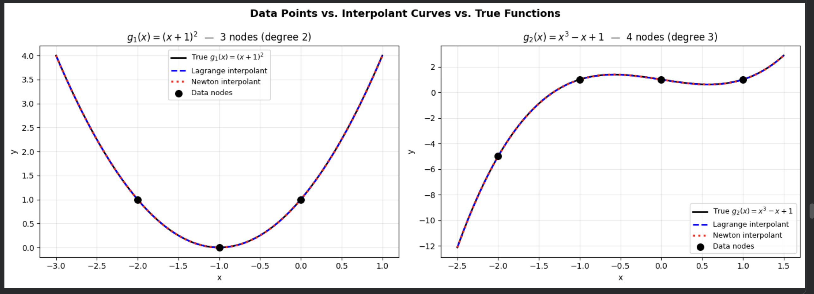
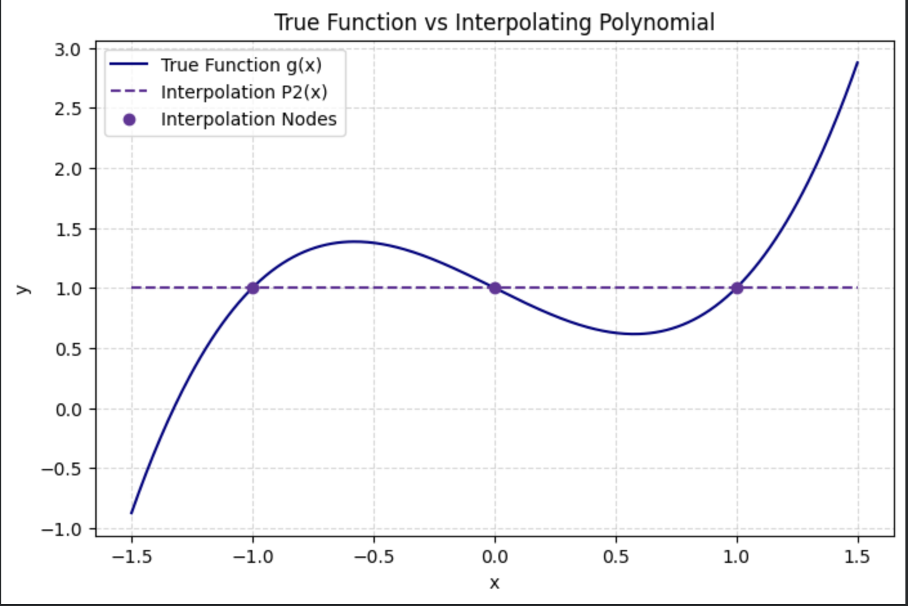

# Scientific Methods: Numerical Analysis📊 
A streamlined implementation of numerical methods for error estimation and polynomial interpolation, developed at **Umm Al-Qura University (UQU)**.
## 🛠️ Core Features
* **Error Analysis:** Truncation, Round-off, and Propagation error studies.
* **Interpolation:** Dual-method implementation (Newton & Lagrange) for function approximation.
* **Analysis:** Study of Runge’s Phenomenon and polynomial sensitivity.
## 📊 Visual Results
Here is a glimpse of the numerical convergence and interpolation accuracy achieved in this project:

  

  

*Top: Error convergence analysis (Taylor Series) | Bottom: Interpolating polynomial vs. True function.*

## 💻 Tech Stack
`Python` | `NumPy` | `Pandas` | `Matplotlib`

